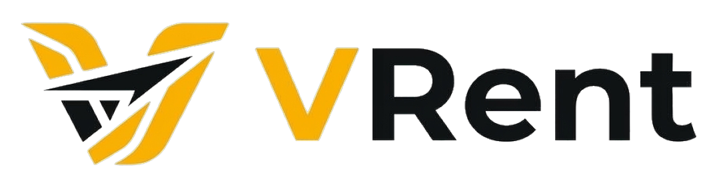

<p align="center">
  
</p>

<h1 align="center">RentGo — Platform Rental Mobil & Motor Terintegrasi</h1>

<p align="center">
  <strong>Modern Multi-Tenant Vehicle Rental Marketplace Platform with Real-Time Scheduling & Pinpoint Delivery</strong>
</p>

<p align="center">
  
  
  
  
  
  
  
</p>

---

## 📌 Tentang RentGo

**RentGo** adalah platform marketplace penyewaan kendaraan (mobil dan motor) multi-tenant modern yang menghubungkan pelanggan dengan mitra rental terverifikasi di berbagai kota di Indonesia. Dibangun menggunakan arsitektur monolitik modern **Laravel 11 + Inertia.js + React**, RentGo menyajikan performa SPA (Single Page Application) yang mulus dengan keamanan dan kehandalan backend Laravel.

Platform ini dirancang untuk mengatasi masalah utama dalam bisnis rental konvensional: pencatatan jadwal tumpang-tindih (*double booking*), ketidakpastian lokasi serah terima, serta proses verifikasi identitas penyewa yang belum terpusat.

---

## ✨ Fitur Utama

### 1. 🛡️ Multi-Role Authentication & Access Control
- **Super Admin**: Monitoring operasional platform, verifikasi mitra & dokumen legalitas, moderasi sengketa (*dispute*), laporan komisi finansial, dan audit unit kendaraan.
- **Mitra Rental (Agent/Partner)**: Manajemen etalase toko digital, pengelolaan armada kendaraan, manajemen kalender ketersediaan/servis, monitoring pesanan & bukti pembayaran.
- **Customer / Pelanggan**: Pencarian armada dengan filter kota/tipe, sistem pemesanan interaktif, pelacakan riwayat booking, struk transaksi, dan fitur rating/ulasan.

### 2. 📅 Real-Time Booking & Conflict Prevention System
- **Pencegahan Bentrok Otomatis**: Sistem secara otomatis mengecek jadwal sewa aktif (`bookedRanges`) dan periode servis (`maintenance`).
- **Validasi Kalender Frontend & Backend**: Jika pelanggan memilih rentang tanggal yang bersinggungan dengan jadwal sewa yang telah terisi, tombol submit otomatis terkunci dan menampilkan notifikasi bentrok jadwal secara instan.
- **Status Armada Dinamis**: Armada yang sedang disewa hari ini otomatis menampilkan lencana `Sedang Disewa (s/d [tanggal])` di kartu etalase maupun hasil pencarian.

### 3. 📍 Gojek-Style Pinpoint Delivery & Fare Calculation
- **Dua Metode Serah Terima**: Pilihan **Ambil Sendiri (*Self-Pickup*)** di garasi mitra atau **Diantarkan (*Delivery*)** ke lokasi penyewa.
- **Peta Interaktif (Leaflet / OpenStreetMap)**: Penandaan titik lokasi pengantaran presisi dengan fitur *drag & pin* serta input patokan (*landmark*).
- **Kalkulasi Ongkir Otomatis**: Perhitungan jarak jalan riil (Haversine formula + road-factor) dengan tarif berjenjang berbasis kilometer (tarif dasar 0–3 km + tarif per km untuk mobil/motor).

### 4. 🏪 Etalase & Branding Toko Mitra
- **Halaman Profil Mitra Eksklusif** (`/mitra/{id}`): Desain visual otomotif premium dengan banner kustom, logo mitra, lencana terverifikasi, rating ulasan, jam operasional, dan lokasi cabang.
- **Pengaturan Banner & Logo**: Mitra dapat mengunggah dan mengatur identitas toko mereka secara mandiri dari portal profil mitra.

### 5. 📑 KYC & Compliance Security
- **Verifikasi Dokumen Identitas**: Customer wajib mengunggah KTP dan SIM aktif sebelum dapat mengajukan pesanan sewa.
- **Gatekeeper Pemesanan**: Sistem memblokir proses checkout jika dokumen belum lengkap atau berstatus ditolak oleh verifikator.

---

## 🛠️ Tech Stack

| Lapisan | Teknologi |
|---|---|
| **Backend Framework** | [Laravel 11.x](https://laravel.com/) (PHP 8.2+) |
| **Frontend Framework** | [React 18.x](https://react.dev/) via [Inertia.js v1](https://inertiajs.com/) |
| **Styling** | [Tailwind CSS 3.x](https://tailwindcss.com/) & Vanilla CSS Micro-animations |
| **Database** | [MySQL 8.x](https://www.mysql.com/) / MariaDB |
| **Mapping Engine** | [Leaflet.js](https://leafletjs.com/) & OpenStreetMap Tiles |
| **Role & Permission** | [Spatie Laravel Permission](https://spatie.be/docs/laravel-permission) |
| **Asset Bundler** | [Vite](https://vitejs.dev/) |

---

## 🚀 Panduan Instalasi Lokal

Ikuti langkah-langkah di bawah ini untuk menjalankan RentGo di komputer lokal Anda:

### Prasyarat
- PHP >= 8.2 (dengan ekstensi: `pdo_mysql`, `mbstring`, `openssl`, `gd`, `fileinfo`)
- Composer >= 2.x
- Node.js >= 18.x & NPM
- MySQL Server (misalnya melalui Laragon, XAMPP, atau Docker)

### 1. Clone Repository
```bash
git clone https://github.com/FHRRZZZ/RentGo.git
cd RentGo
```

### 2. Install Dependensi PHP & Node.js
```bash
composer install
npm install
```

### 3. Konfigurasi Environment (`.env`)
Salin file `.env.example` menjadi `.env`:
```bash
cp .env.example .env
```
Sesuaikan konfigurasi database pada `.env`:
```env
DB_CONNECTION=mysql
DB_HOST=127.0.0.1
DB_PORT=3306
DB_DATABASE=rentgo
DB_USERNAME=root
DB_PASSWORD=
```

Generate application key:
```bash
php artisan key:generate
```

### 4. Migrasi & Seeding Database
Jalankan migrasi tabel beserta akun demo bawaan:
```bash
php artisan migrate --seed
```

### 5. Buat Symbolic Link Storage
Agar aset logo mitra, banner, dan foto kendaraan dapat diakses oleh publik:
```bash
php artisan storage:link
```

### 6. Jalankan Server Pengembangan
Buka 2 terminal terpisah:

**Terminal 1 (Backend Laravel Server):**
```bash
php artisan serve
```

**Terminal 2 (Vite Frontend Hot-Reload):**
```bash
npm run dev
```

Aplikasi kini dapat diakses di browser melalui: **`http://localhost:8000`** (atau URL virtual host Laragon).

---

## 🔑 Akun Demo Default

Setelah menjalankan `php artisan migrate --seed`, akun demo berikut siap digunakan:

| Peran | Email | Password | Akses URL |
|---|---|---|---|
| **Super Admin** | `admin@rentgo.test` | `password` | `/admin` |
| **Mitra Rental** | `mitra@rentgo.test` | `password` | `/mitra` |
| **Customer** | `customer@rentgo.test` | `password` | `/login` |

---

## 📂 Struktur Direktori Utama

```
RentGo/
├── app/
│   ├── Http/Controllers/
│   │   ├── Admin/               # Controller Dashboard & Manajemen Admin
│   │   ├── Agent/               # Controller Portal Mitra
│   │   └── Shared/              # Controller Katalog, Pencarian & Toko
│   ├── Models/                  # Model Eloquent (User, Vehicle, Booking, dll)
│   └── Services/                # Business logic (BookingService, ComplianceService)
├── database/
│   ├── migrations/              # Skema tabel database
│   └── seeders/                 # Seeder peran & data awal
├── public/                      # Static assets, logo, favicon, gambar
├── resources/
│   ├── js/
│   │   ├── Components/          # Komponen UI Reusable & LocationPicker
│   │   ├── Layouts/             # AdminLayout, AgentLayout, CustomerLayout
│   │   └── Pages/               # Halaman React Inertia (Admin, Mitra, Vehicle, Order)
│   └── views/
│       └── app.blade.php        # Root Blade template (Fonts, Favicon, Inertia head)
└── routes/
    ├── web.php                  # Rute aplikasi & proteksi middleware
    └── auth.php                 # Rute autentikasi Breeze
```

---

## 🤝 Kontribusi

Kontribusi selalu terbuka! Jika Anda menemukan bug atau memiliki ide perbaikan fitur:
1. Fork repository ini
2. Buat branch fitur baru (`git checkout -b fitur/NamaFitur`)
3. Commit perubahan Anda (`git commit -m 'feat: Menambahkan fitur X'`)
4. Push ke branch Anda (`git push origin fitur/NamaFitur`)
5. Ajukan **Pull Request**

---

## 📄 Lisensi

Proyek ini dilisensikan di bawah lisensi [MIT License](LICENSE).
Dikembangkan dengan ❤️ oleh **[FHRRZZZ](https://github.com/FHRRZZZ)**.
